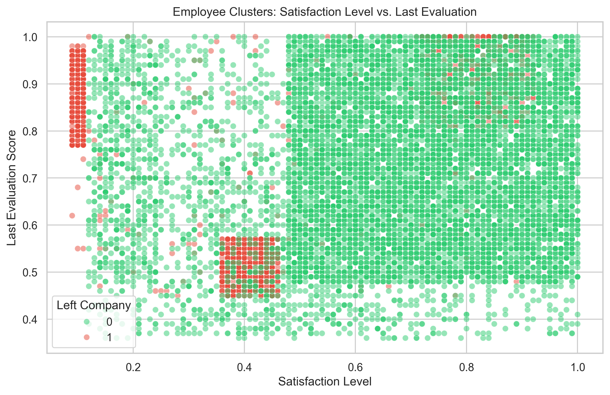
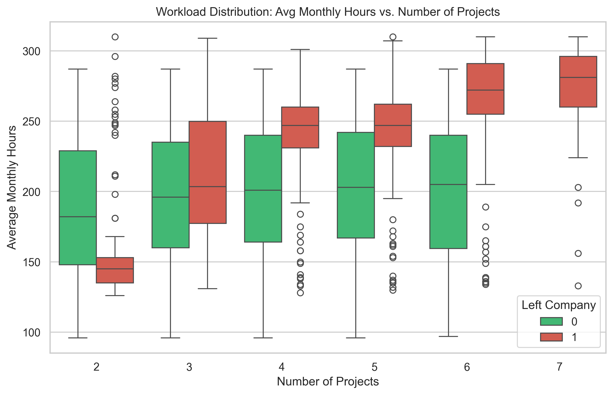
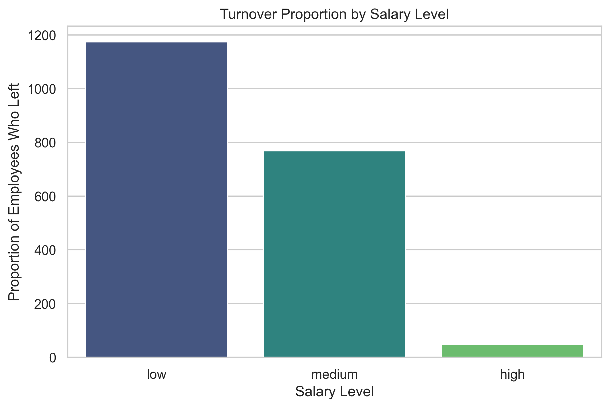
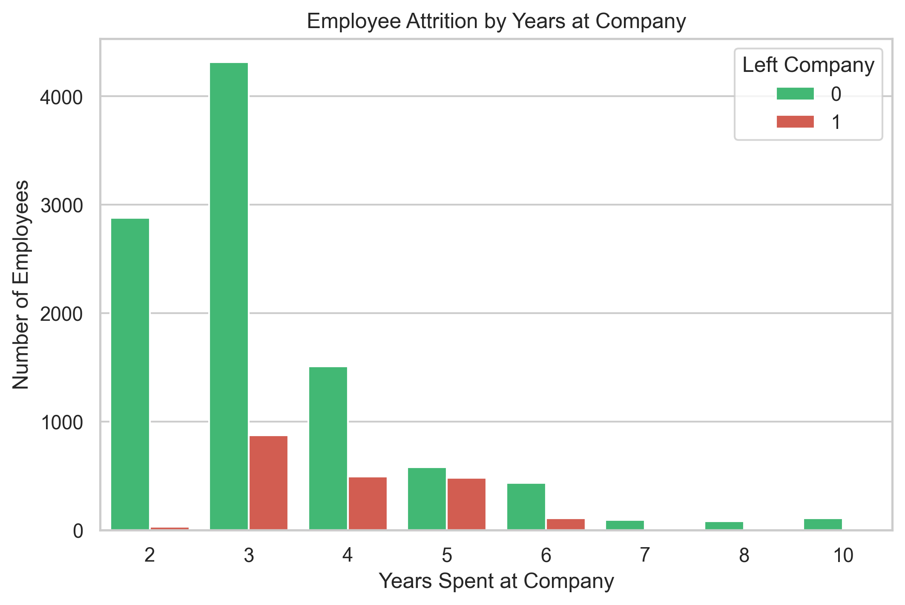
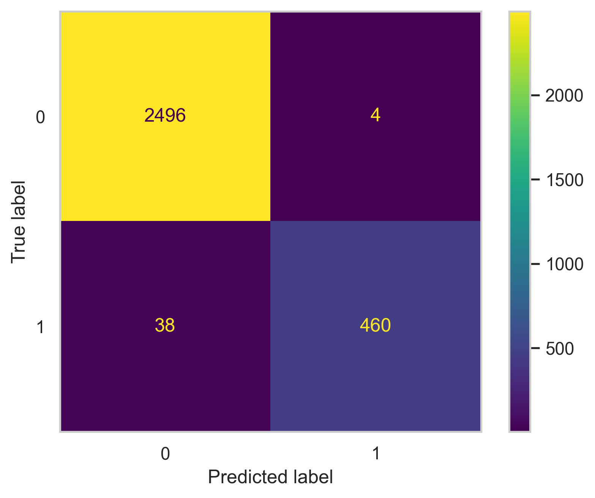
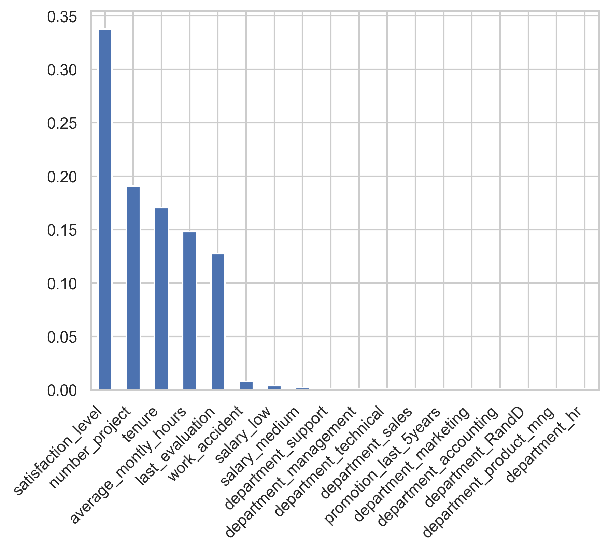

# Predicting Employee Turnover to Drive HR Retention Strategies

## 📌 Abstract
Salifort Motors, a global consulting firm, is currently experiencing an unusually high rate of employee turnover. This attrition significantly impacts the company's bottom line through increased recruitment costs, lost productivity, and diminished team morale. This project utilizes the **PACE (Plan, Analyze, Construct, Execute) framework** to transition HR from a reactive replacement approach to a proactive retention strategy.

By developing a **Random Forest Classifier**, this analysis identifies employees at high risk of leaving and uncovers the core drivers of turnover. The final model achieved an **Accuracy of 99% and a Precision of 99%**. The results indicate that turnover is primarily driven by satisfaction levels, extreme workload imbalances, and a critical 3–5 year tenure window.

---

## 📂 Data & Preprocessing
The dataset consists of 14,999 employee records with 10 variables, including satisfaction levels, performance evaluations, and workload metrics.

### Preprocessing Pipeline
* **Data Cleaning**: Identified and removed **3,008 duplicated rows** to prevent biased predictions and overweighting specific profiles.
* **Standardization**: Renamed columns to standardized `snake_case` (e.g., `time_spend_company` was renamed to `tenure`).
* **Feature Engineering**: Converted categorical features (`department` and `salary`) into numeric formats using **One-Hot Encoding**.
* **Data Splitting**: Split the data into a 75/25 Train-Test set. Stratification was used to ensure the ~16.6% turnover class imbalance was maintained in both sets.

---

## 📈 Exploratory Data Analysis (EDA)
Extensive visualization was conducted to map the relationships between workload, performance, and attrition.

### 1. Risk Segmentation (Satisfaction vs. Evaluation)

*Figure 1: Employee Clusters: Satisfaction Level vs. Last Evaluation*

**Insight:** The data reveals three highly distinct "flight risk" clusters. **The Burned Out** (top performers with low satisfaction), **The Underperformers** (struggling with both metrics), and **The Ambitious** (top-tier employees with high satisfaction who likely leave for better growth opportunities elsewhere).

### 2. Workload Imbalances (Monthly Hours vs. Projects)

*Figure 2: Workload Distribution: Avg Monthly Hours vs. Number of Projects*

**Insight:** There is a clear "sweet spot" for retention at **3 to 4 projects**. Employees falling outside this range are at high risk: those with only 2 projects are significantly underutilized, while those with 6–7 projects are consistently overworked, often exceeding 250–300 monthly hours.

### 3. Tenure & Salary Trends

*Figure 3: Turnover Proportion by Salary Level*

*Figure 4: Employee Attrition by Years at Company*

**Insight:** While "low" salary earners quit at the highest rate, compensation is not the only factor. A dramatic spike in turnover occurs specifically at the **3, 4, and 5-year marks**, suggesting a systemic issue with mid-level career progression and long-term engagement.

---

## 🧠 Model Architecture
Because the EDA revealed non-linear relationships, a **Random Forest Classifier** was selected for its robustness and ability to provide feature importance metrics.

* **Model**: Scikit-Learn `RandomForestClassifier`.
* **Optimization**: `GridSearchCV` was used to test 36 combinations of hyperparameters.
* **Refit Metric**: **F1-Score** (0.944 on training set) to minimize both false positives and false negatives.
* **Best Parameters**: `max_depth: 15`, `min_samples_leaf: 1`, `min_samples_split: 10`.

---

## 📊 Results & Performance
The model demonstrated exceptional predictive power on the unseen test set, providing HR with a highly reliable deployment tool.

| Metric | Score |
| :--- | :--- |
| **Accuracy** | **0.99** |
| **Precision** | **0.99** |
| **Recall** | **0.92** |
| **F1-Score** | **0.96** |

### Confusion Matrix & Feature Importance
The confusion matrix confirms that the model produced only **4 false positives** across 3,000 cases. Feature importance metrics show **satisfaction_level** as the primary driver, followed by project count and tenure.

*Figure 5: Random Forest Confusion Matrix*

*Figure 6: Feature Importance Analysis*

---

## 🔍 Key Insights & Discussion
1. **Burnout is the Core Driver**: Turnover is heavily concentrated among top performers experiencing extreme workloads and those crossing the 3–5 year tenure threshold.
2. **Precision in Action**: The 99% precision rate means HR can confidently prioritize outreach to flagged individuals without wasting resources on employees likely to stay.
3. **Sentiment > Salary**: Compensation and department hold virtually zero predictive weight compared to how employees feel about their daily project load and satisfaction levels.

## 🚀 Future Improvements
* **Automated Pipeline**: Package the model to run monthly against current employee records for a live HR dashboard.
* **Financial ROI Analysis**: Quantify savings by multiplying true positive predictions by the average cost of employee replacement.
* **Review Cycle Overhaul**: Transition from annual reviews to quarterly "pulse checks" to catch dipping satisfaction levels early, particularly for high-value talent.

---
*© 2026 Ryan Tang.*
